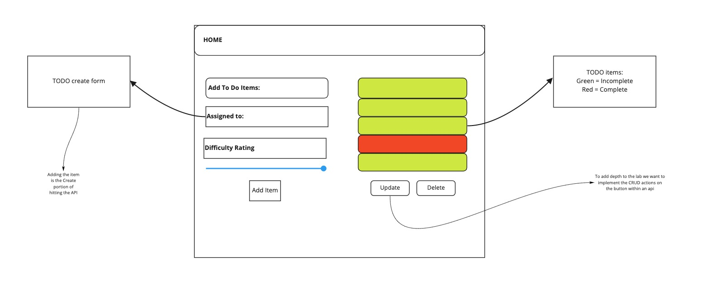

# TODO App

## Author: Jason Taisey

### Links & Resources

[Deployed Site](https://friendly-ramanujan-1fdaa1.netlify.app/)
[Pull Requests](https://github.com/JTaisey389/todo/pull/1)

### About this Application

In this initial phase, we’re going to have to start by converting a legacy application into a more modern architecture. Our initial “Proof of Concept” was written using class based components and was not properly styled. Now that our client has given us the “green light” for development, we’re going to refactor the application using Hooks and upgrading the style.

### Dependencies
 
- bootstrap
- react
- react-bootstrap
- react-dom
- react-scripts

### User Stories

**Phase 1**
The following user/developer stories detail the major functionality for this phase of the project.

- As a user, I would like an easy way to add a new to do item using an online interface

- As a user, I would like my to do items to have an assignee, due date, difficulty meter, status and the task itself

- As a user, I would like to delete to do items that are no longer needed

- As a user, I would like to easily mark to do items as completed

- As a user, I would like to edit an existing to do item

**Phase 2**

- As a user, I would like to be able to add, update, and delete To Do items

- As a user, I would like my To Do Items to be permanently stored so that I can re-access them at any time, using any device

**Phase 3**

- As a user, I would like to see my To Do List Items a few at a time so that I don’t have to wade through them all

- As a user, I would like my default view to only be “Incomplete” Items so that I can quickly determine what I have to do.

- As a user, I would like my list sorted by difficulty so that I can more easily prioritize

- As a user, I would like the option to change my default preferences with regards to how many Items I see per page, which items are filtered, and how they are sorted

**Phase 4**

- As a user, I want to provide a way for other users to create new accounts

- As a user, I want to provide a way for all users to login to their account

- As a user, I want to make sure that my To Do items are only viewable to users that have logged in with a valid account.

- As a user, I want to ensure that only fellow users that are allowed to “create”, based on their user type, can add new To Do Items

- As a user, I want to ensure that only fellow users that are allowed to “update”, based on their user type, can mark To Do Items complete

- As a user, I want to ensure that only fellow users that are allowed to “delete”, based on their user type, can delete new To Do Items

### Day 1

**Event Architecture**

### Day 2

**Event Architecture**

### Day 3

**Event Architecture**

**Technical Requirements**

Workflow changes:

On application start, display all of the to do items from the API/Database
When adding an item, issue a POST request to the API server
When marking items complete, issue a PUT request to the API server for the item
When deleting items, issue a DELETE request to the API server for the item

Test